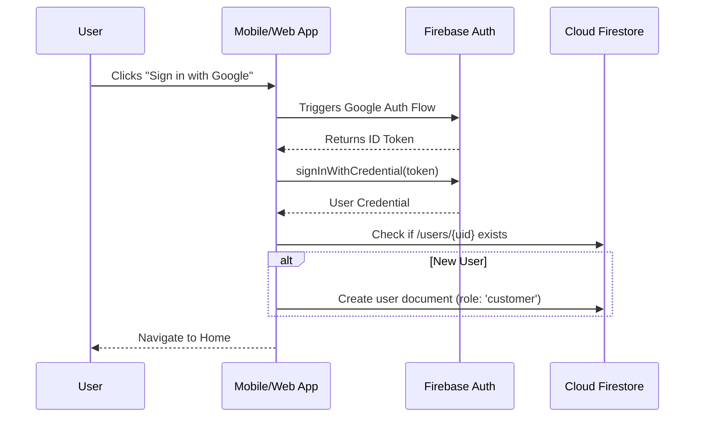

# Tama Clothing - Integration & Technical Details

## 1. Authentication Flow (Mermaid)



## 2. Multilingual Architecture (French & Derja)

We use a "Fallback & Namespace" approach for translations:
- **Static UI**: JSON files in the app bundle for fixed assets (e.g., "Add to cart").
- **Dynamic Content**: Stored in Firestore in a map format:
  ```json
  "name": {
    "fr": "Chemise en lin",
    "ar-tn": "سورية كتان"
  }
  ```
- **Translation Management**: The Admin Panel includes an interface to edit these fields in real-time without app updates.

## 3. Payment Strategy (Tunisia)

To ensure modularity, we use a **Strategy Pattern** for payments:
- **COD Strategy**: Simple order status update.
- **Electronic Strategy**:
  1. App calls Firebase Function `createPaymentSession`.
  2. Function interacts with local aggregator (Paymee/ClickToPay).
  3. Returns a redirect URL or Payment Intent.
  4. Webhook from provider updates Firestore order status to `paid`.

---

## 4. Admin Panel Key Features
- **Dashboard**: High-level sales and order volume.
- **Inventory**: Stock tracking with low-stock alerts.
- **User Roles**: Ability to promote users to 'Staff' or 'Admin'.
